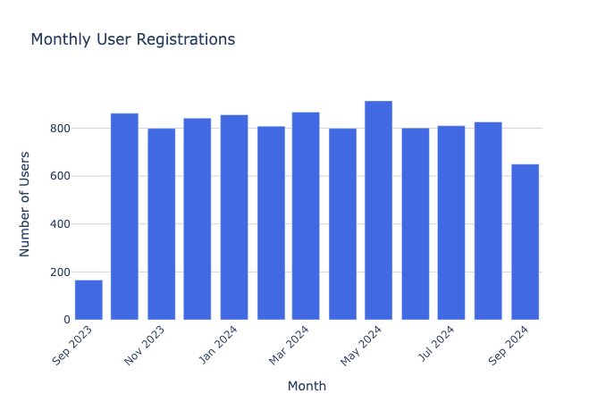

# Creating a Data Visualisation Crew with crewAI

This example project shows how you can use [crewAI][1] and [LangChain][2].

## Steps

1. Create a new python (3.10) virtual environment and install the requirements.

```
python -m venv .venv
source .venv/scripts/activate
python -m pip install --upgrade pip
pip install -r requirements.txt
```

2. Create and populate the fake database `example.db`

```
python sql_database/create_sql_database.py
python sql_database/populate_datebase.py
```

3. Create a `.env` file that has an active OpenAI API Key: `OPENAI_API_KEY=`

4. Run through the `sql_crew.ipynb` notebook. <p style="color: red;"> Watch out for the warning and the LLM generated python code execution</p>

### Output plot

- Output from running the `exec(python_output_code)` cell. (It doesn't save/render in the browser).



<!-- Links -->
[1]: https://www.crewai.com/
[2]: https://www.langchain.com/